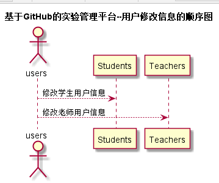
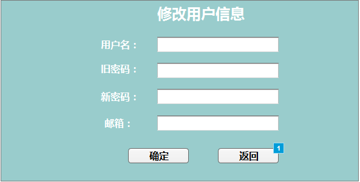

<!-- markdownlint-disable MD033-->
<!-- 禁止MD033类型的警告 https://www.npmjs.com/package/markdownlint -->

# “修改用户信息”用例 [返回](../README.md)
## 1. 用例规约

|用例名称|修改用户信息|
|-------|:-------------|
|功能|修改用户的GitHub用户名称|
|参与者|学生，老师|
|前置条件|必须先登录，并且查看用户现有的GitHub用户名|
|后置条件| |
|主事件流| 1.用户填写GitHub用户名称   2.用户提交修改信息  3.系统存储修改后的GitHub用户名称|
|备选事件流|1a. 如果用户输入的GitHub用户名称为空  &nbsp;&nbsp; 1.系统清空用户的GitHub用户名称|

## 2. 业务流程 [源码](../src/alter_user_information.puml)
 

## 3. 界面设计
- 界面参照: https://weidanxue2.github.io/is_analysis/test6/ui/顶部菜单.html
- API接口调用
    - 接口：[alter_user_information](../interface/alter_user_information.md)
   
## 4. 算法描述
- USER_NAME解析为字符串。
  - 前台将个人信息修改设置为链接到新的页面，点击个人信息时链接。其中USER_NAME显示在输入框中，并设置旧密码和新密码的文本框和一个“修改”按钮。用户可以在输入框中改变原有的字符。修改密码则需要输入原来的密码，默认为用户名，最后点击提交则表示修改信息。

## 5. 界面设计

    
## 6. 参照表
- [USERS](../数据库设计.md/#USERS)
