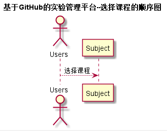

# “选择课程”用例 [返回](./README.md)
## 1. 用例规约

|用例名称|选择课程|
|-------|:-------------|
|功能|用户登录之后需要确定选择的课程名称|
|参与者|学生，老师|
|前置条件|学生，老师需要先登录到自己的账号|
|后置条件| |
|主流事件| |
|备注| |

## 2. 业务流程（顺序图） [源码](../src/select_course.puml)
 

## 3. 界面设计
界面参照: https://weidanxue2.github.io/is_analysis/test6/index.html

## 4. 算法描述（活动图）

无
## 5. 参照表

- [students](../数据库设计.md/#STUDENTS)
- [teachers](../数据库设计.md/#TEACHERS)
- [subject](../数据库设计.md/#SUBJECTS)
## 6. API接口设计

- 接口名称：select_course
    
- 功能：
    返回该用户所存在课程的课程列表。   
    
    该接口服务于：http://202.115.82.8:1522
    
- API请求地址： 
    [select_course](../interface/select_course.md)

- 请求方式 ：
    GET  

- 请求参数说明:        
    请求有两个参数：user_id、subject_id，user_id参数为用户Id确定用户信息，以便后台查找该用户的相关数据信息。subject_id确定课程。
    
- 返回实例：

        {
            "status": true,
            "subject"：[
                "高等数学",
                "线性代数",
                "概率论"
            ]
        }
  
- 返回参数说明：    
 
  |参数名称|说明|
  |:---------:|:--------------------------------------------------------|      
  |status|bool类型，true表示正确的返回，false表示有错误|
  |subject|数组类型，元素表示课程名称|
